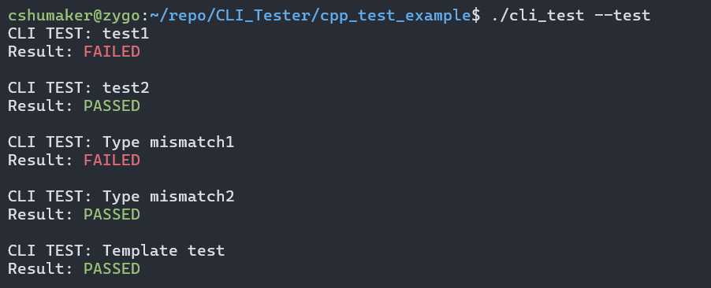

# CLI_Test
This will be a command line unit test tool. The .hpp file works using c++ specific things like templates and std::types. A C reliant header file will be in the works that will use fun pointer and manually dynamic list methods.

## What I Want
I want this to be a very simple framework. Ideally it would be a single header file. I want a nice looking list of tests and if they passed.

## Usage
1. Create a .cpp file for your testing. Include the "cli_test.cpp" header file.
2. Create whatever unit tests you want using your classes / functions / objects.
3. In the main function, include this:
```cpp
int main(int argc, char** argv){
        init_testing_mode(argc, argv);
        test_main();
        run_tests();
        /*Other code*/
}
```
4. If you want to run the tests, execute it as such:
```
./{EXECUTABLE} --test
```
This will forgo anything in your main function after "run_tests()" is called in main.

### Writing Unit Tests
This is the syntax to write a unit test:
```cpp
int test_main(){
    //This test will pass
    TEST("test_name", {
        CLI::is_equal(2, 2),
        CLI::is_not_equal(1, 2),
        CLI::is_true(true),
        CLI::is_not_true(false),
        CLI::is_same_type(1.0, 1.0),
        CLI::is_not_same_type(1.0, 1),
    });
}
```

## Output Example

